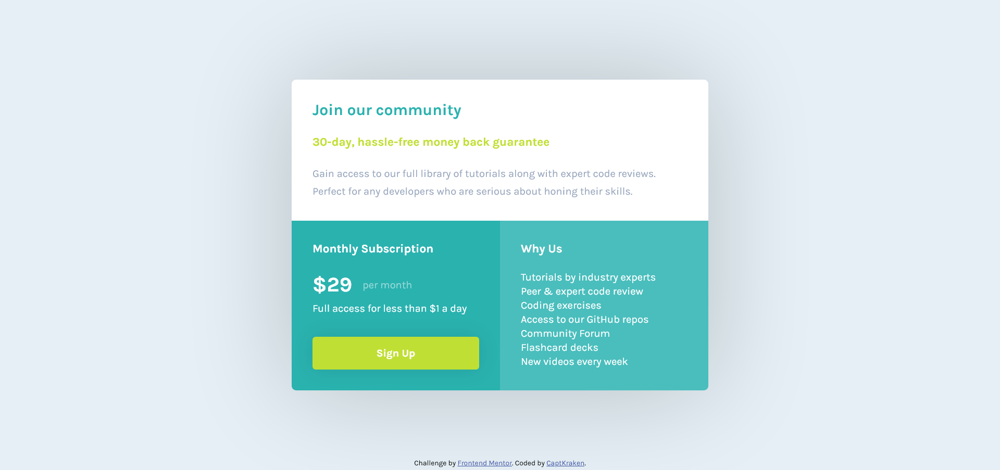

## Table of contents

- [Overview](#overview)
  - [The challenge](#the-challenge)
  - [Screenshot](#screenshot)
  - [Links](#links)
- [My process](#my-process)
  - [Built with](#built-with)
- [Author](#author)
- [Acknowledgments](#acknowledgments)

## Overview

this is another solution to the problem on Frontend Mentor.

My other solution: [Using Flexbox](https://www.frontendmentor.io/solutions/single-price-grid-component-desktopfirst-html-and-scss-d4q23ybYC)

### The challenge

Your users should be able to:

- View the optimal layout for the component depending on their device's screen size
- See a hover state on desktop for the Sign Up call-to-action

### Screenshot

### Links

- Solution URL: [On Frontend Mentor](https://www.frontendmentor.io/solutions/single-price-grid-component-desktopfirst-html-and-scss-grid-TtpFBwyg6)
- Live Site URL: [Live Demo](https://captkraken.github.io/single-price-grid-component-grid/)

## My process

Started out with HTML then went the desktop-first route. After that, started modifying things to fix the problems. when it's in the mobile screen query, i just change the font size this time. looks like it works just fine.

### Built with

- HTML5
- Sass
- CSS Grid

## Author

- Website - [My Github](https://github.com/CaptKraken)
- Frontend Mentor - [@CaptKraken](https://www.frontendmentor.io/profile/CaptKraken)

## Acknowledgments

I would like to thank [Grace Snow](https://www.frontendmentor.io/profile/grace-snow) again 🙏

she suggested that i do another one, but with CSS Grid instead.
